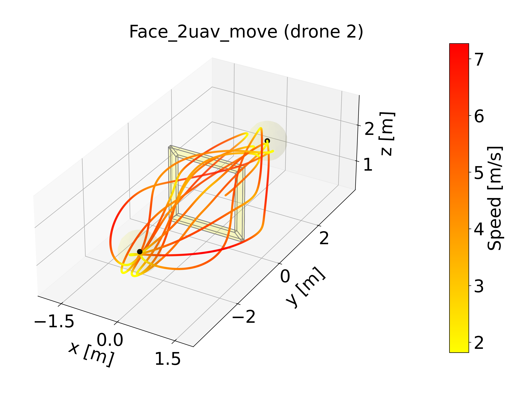

<p align="center">
  <h1 align="center"><ins>Dashing for the Golden Snitch:</ins>✨<br>Multi-Drone RL (V0.3.0)</h1>
  <h2 align="center">
    <a href="https://youtu.be/KACuFMtGGpo" align="center">Video ⤵️</a>
  </h2>
</p>

<p align="center">
  <a href="https://youtu.be/KACuFMtGGpo">
    
  </a>
  <br>
  <em>Real-world experiments with two quadrotors achieve a maximum speed of 13.65 m/s and a maximum body rate</em>
  <br>
  <em> of 13.4 rad/s in a 5.5 m x 5.5 m x 2.0 m space across various tracks, relying entirely on onboard computation.</em>
</p>

## Table of Contents

1. [Introduction](#introduction)
   - [News](#news)
   - [Related Papers](#related-papers)
2. [Quick Installation](#quick-installation)
3. [Usage](#usage)
   - [Start training](#start-training-beta)
   - [Evaluation](#evaluation-beta)
4. [Citation](#citation)
5. [License](#license)

> [!NOTE]
> For detailed instructions on installation, training, evaluation, and a full list of command-line arguments, please refer to our **[User Manual](docs/USER_MANUAL.md)**.

## Introduction

- **A multi-agent environment for time-optimal motion planning**. This repository uses multi-agent reinforcement learning to present a decentralized policy network for time-optimal multi-drone flight.
- This project is **a reimplementation of** [gym-pybullet-drones](https://github.com/utiasDSL/gym-pybullet-drones) **optimized for multi-agent scenarios**. We have adjusted the code to make it more suitable for handling many agents simultaneously.
- We **customize PPO** in *a centralized training, decentralized execution* (CTDE) fashion, based on [stable-baselines3](https://github.com/DLR-RM/stable-baselines3) and inspired by the [on-policy(MAPPO)](https://github.com/marlbenchmark/on-policy) repository.

### News

- **July 17, 2025**: 📢 Full multi-agent version released!
- **May 31, 2025**: 🚀 Full Single-agent version released!
- **April 7, 2025**: 🚀 Single-agent version released! Now available for training and testing (beta) in single-drone scenarios.
- **March 5, 2025**: 📄 The camera-ready version of our paper has been updated on [arXiv](https://arxiv.org/abs/2409.16720).
- **January 27, 2025**: 🎉 Our paper has been accepted to **ICRA 2025**!
- **September 25, 2024**: 📝 Paper preprint available on arXiv.

### Related Papers
- [**Dashing for the Golden Snitch: Multi-Drone Time-Optimal Motion Planning with Multi-Agent Reinforcement Learning**](https://arxiv.org/abs/2409.16720),  Wang, X., Zhou, J., Feng, Y., Mei, J., Chen, J., & Li, S. (2024), arXiv preprint arXiv:2409.16720. **Accepted at ICRA 2025**.

## Quick Installation

1.  **Create Environment**:
    ```bash
    conda create -n marl_drones python=3.11
    conda activate marl_drones
    ```

2.  **Clone and Install**:
    ```bash
    git clone git@github.com:KafuuChikai/Dashing-for-the-Golden-Snitch-Multi-Drone-RL.git
    cd Dashing-for-the-Golden-Snitch-Multi-Drone-RL
    git submodule update --init --recursive
    pip install -e .
    ```

3.  **Install PyTorch**:
    Install the correct version of **PyTorch** for your system by following the [official instructions](https://pytorch.org/get-started/locally/).

For more advanced installation options (e.g., for development), see the [User Manual](docs/USER_MANUAL.md).

## Usage

### Start Training

To start training, run one of the following commands:

- **For single-agent training:**
   ```bash
   python scripts/train.py -e hover_race
   ```

- **For multi-agent training (2 drones):**
   ```bash
   python scripts/train.py -e race_multi_2
   ```

> [!TIP]
> If your computer's performance is limited, you can reduce the number of parallel environments to lower resource usage. For example, use `-B 16` to run 16 environments in parallel.

### Evaluation

|  |  |
| :---------- | :---------- |
| <video src="https://github.com/user-attachments/assets/4971501e-bc81-4c1a-aec7-e794125dc193" /> | <video src="https://github.com/user-attachments/assets/4211e1ae-d321-45bf-bf8a-52991d878eea" /> |

|  |  |  |
| :---------- | :---------- | :---------- |
|  |  | <video src="https://github.com/user-attachments/assets/2e0c4502-95e2-4b02-94cf-f87b21c82db0" /> |

1. To evaluate the `hover_race` demo, run the following:

   ```bash
   python scripts/eval.py -e hover_race -m demo_model/Race_single.pt -v 2 --track single_drone/UZH_single.yaml
   ```

2. To evaluate the `race_multi_2` demo, run the following:

   ```bash
   python scripts/eval.py -e race_multi_2 -m demo_model/Race_multi_2.pt -v 2 --track 2_drones/Star_5_multi_2uav.yaml
   ```

3. To evaluate the `race_multi_2` demo with **moving gates**, run the following:

   ```bash
   python scripts/eval.py -e race_multi_2 -m demo_model/Race_multi_2.pt -v 2 --track 2_drones/Face_2uav_move.yaml
   ```

For evaluation instructions and a full list of command-line arguments, please see the [User Manual](docs/USER_MANUAL.md).

## Citation

If you use this repository in your research, please consider citing:

```bibtex
@article{Wang2024Dashing,
  author = {Wang, X. and Zhou, J. and Feng, Y. and Mei, J. and Chen, J. and Li, S.},
  title = {Dashing for the Golden Snitch: Multi-Drone Time-Optimal Motion Planning with Multi-Agent Reinforcement Learning},
  journal = {arXiv preprint arXiv:2409.16720},
  year = {2024},
  url = {https://arxiv.org/abs/2409.16720}
}
```

## License
This project is released under the MIT License. Please review the [License file](LICENSE) for more details.