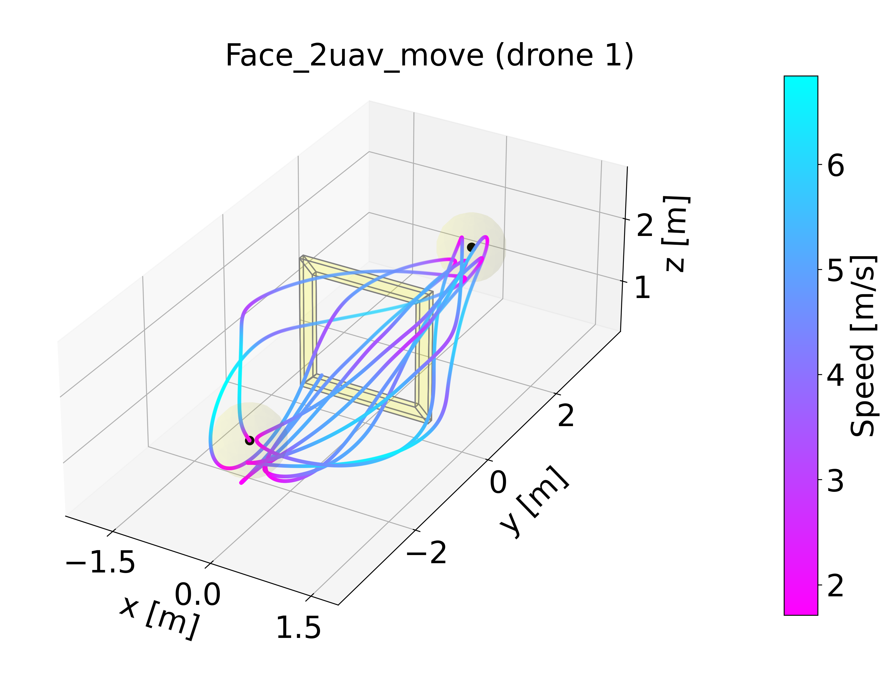
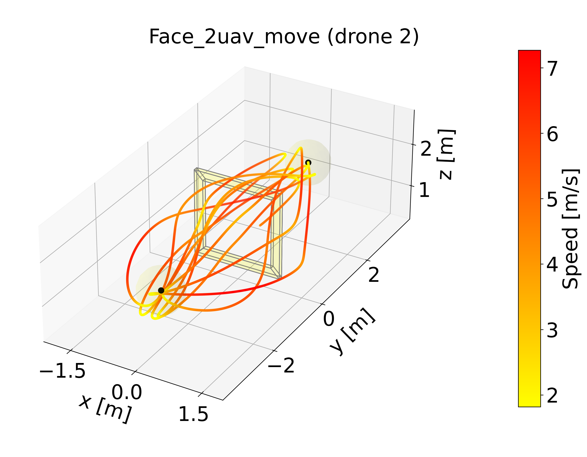

# Gym-Drones User Manual

This document provides detailed instructions for installation, training, and evaluation.

## Table of Contents

1. [Detailed Installation](#1-detailed-installation)
2. [Training Guide](#2-training-guide)
   - [Available Environments](#available-environments)
   - [Training Command-Line Arguments](#training-command-line-arguments)
   - [Training Examples](#training-examples)
3. [Evaluation Guide](#3-evaluation-guide)
   - [Evaluation Command-Line Arguments](#evaluation-command-line-arguments)
   - [Evaluation Examples](#evaluation-examples)

## 1. Detailed Installation

It's recommended to use a virtual environment, such as conda:

```bash
conda create -n marl_drones python=3.11 # Requires Python >= 3.10
conda activate marl_drones
```

### Cloning and Setup

1.  For the latest version, clone the repository and its submodules locally:

    ```bash
    # clone the repository
    git clone git@github.com:KafuuChikai/Dashing-for-the-Golden-Snitch-Multi-Drone-RL.git
    cd Dashing-for-the-Golden-Snitch-Multi-Drone-RL
    
    # update the submodule
    git submodule update --init --recursive
    ```

2.  Install the package and its dependencies. Choose the appropriate method below.

    **For Standard Users**
    ```bash
    # install the package and dependencies
    pip install -e .
    ```

    **For Developers**
    ```bash
    # install main package with development dependencies
    pip install -e .[dev]
    
    # install submodules in editable mode for development
    pip install -e ./gym_drones/utils/stable-baselines3
    pip install -e ./gym_drones/utils/RaceUtils
    
    # setup pre-commit hooks to ensure code quality
    pre-commit install
    ```

3.  Install PyTorch.

    > [!NOTE]
    > **PyTorch** is excluded from the dependencies because its version depends on your system setup. Install the correct version manually based on your hardware and CUDA configuration.

    Install the correct version of **PyTorch** by following the [official instructions](https://pytorch.org/get-started/locally/).

## 2. Training Guide

### Available Environments

Below are the available drone reinforcement learning environments.

**Practical Scenarios:**
| Env Code     | Name                | Description                                                  |
| ------------ | ------------------- | ------------------------------------------------------------ |
| `hover_race` | Race (single drone) | Real drone control scenario, training drones to navigate through tracks |
| `race_multi_2` | Race (2 drones) | Real 2-drone scenario, training drones to navigate through tracks |
| `race_multi_3` | Race (3 drones) | Real 3-drone scenario, training drones to navigate through tracks |
| `race_multi_5` | Race (5 drones) | Real 5-drone scenario, training drones to navigate through tracks |

**Tutorial Examples:**
| Tutorial Code | Name                                    | Description                                                  |
| ------------- | --------------------------------------- | ------------------------------------------------------------ |
| `kin_2d`      | 2D Kinematics ⚠️ **Non-working example** | Simplified 2D movement control, focusing on Y and Z axes only |
| `kin_3d`      | 3D Kinematics ⚠️ **Non-working example** | Complete 3D space movement control                           |
| `kin_rel_2d`  | 2D Relative Kinematics                  | 2D motion control based on relative positions                |
| `kin_rel_3d`  | 3D Relative Kinematics                  | 3D motion control based on relative positions                |
| `pos_rel`     | Position Relative Control               | observe previous step actions                                |
| `rot_rel`     | Rotation Relative Control               | Using rotation matrices for continue orientation observation |

### Training Command-Line Arguments

The `scripts/train.py` script supports the following arguments:

| Arguments             | Short | Type   | Required | Description                                                |
|-----------------------|-------|--------|----------|------------------------------------------------------------|
| `--env`               | `-e`  | `str`  | Yes      | Specify the environment (e.g., `hover_race`).              |
| `--exp_name`          | `-n`  | `str`  | No       | Specify the experiment name.                               |
| `--num_envs`          | `-B`  | `int`  | No       | Specify the number of environments.                        |
| `--max_steps`         | `-M`  | `int`  | No       | Specify the maximum number of steps.                       |
| `--save_num`          | `-S`  | `int`  | No       | Specify the number of checkpoints to save.                 |
| `--load_model`        | `-m`  | `str`  | No       | Specify the path to load a pre-trained model.              |
| `--load_ckpt`         | `-c`  | `str`  | No       | Specify the path to load a checkpoint.                     |
| `--load_step`         | `-s`  | `int`  | No       | Specify the step to load from a checkpoint.                |
| `--config`            | `-f`  | `str`  | No       | Specify the path to the configuration file.                |
| `--verbose`           | `-v`  | `int`  | No       | Specify the verbosity level (e.g., `0`, `1` or `2`).       |
| `--seed`              | None  | `int`  | No	    | Specify the random seed.                                   |
| `--no_reset_t`        | None  | `bool` | No	    |	Do not reset the timestep. default: use `config.yaml`.     |

### Training Examples

- Run training in the `hover_race` environment with 16 parallel environments:
```bash
python scripts/train.py -e hover_race -B 16
```

- To load a pre-trained model and continue training:
```bash
python scripts/train.py -e hover_race -m path/to/model
```

- To use a custom configuration file for training parameters:
```bash
python scripts/train.py -e hover_race -f path/to/config
```

- To load a checkpoint from step `500,000`:
```bash
python scripts/train.py -e hover_race -c path/to/checkpoints -s 500000
```

## 3. Evaluation Guide

|  |  |
| :---------- | :---------- |
| <video src="https://github.com/user-attachments/assets/4971501e-bc81-4c1a-aec7-e794125dc193" /> | <video src="https://github.com/user-attachments/assets/4211e1ae-d321-45bf-bf8a-52991d878eea" /> |

|  |  |  |
| :---------- | :---------- | :---------- |
|  |  | <video src="https://github.com/user-attachments/assets/2e0c4502-95e2-4b02-94cf-f87b21c82db0" /> |

### Evaluation Command-Line Arguments

The `scripts/eval.py` script supports the following arguments:

| Arguments           | Short | Type    | Required | Description                                             |
| ------------------- | ----- | ------- | -------- | ------------------------------------------------------- |
| `--env`             | `-e`  | `str`   | Yes      | Specify the environment (e.g., `hover_race`).           |
| `--exp_name`        | `-n`  | `str`   | No       | Specify the experiment name.                            |
| `--eval_name`       | `-r`  | `str`   | No       | Specify the evaluation name.                            |
| `--load_model`      | `-m`  | `str`   | No       | Specify the path to load a pre-trained model.           |
| `--load_ckpt`       | `-c`  | `str`   | No       | Specify the path to load a checkpoint.                  |
| `--load_step`       | `-s`  | `int`   | No       | Specify the step to load from a checkpoint.             |
| `--save_eval`       | `-S`  | `str`   | No       | Specify the path to save evaluation results.            |
| `--config`          | `-f`  | `str`   | No       | Specify the path to the configuration file.             |
| `--verbose`         | `-v`  | `int`   | No       | Specify the verbosity level (e.g., `0`, `1` or `2`).    |
| `--no_ow`           | `-k`  | `bool`  | No       | Do not overwrite the results.                           |
| `--seed`            | None  | `int`   | No       | Specify the random seed.                                |
| `--comment`         | None  | `str`   | No       | Specify a comment for the results (default: `results`). |
| `--track`           | None  | `str`   | No       | Specify the track name.                                 |
| `--track_sigma`     | None  | `float` | No       | Specify the track noise.                                |
| `--save_timestamps` | None  | `bool`  | No       | Save files with timestamps (flag argument).             |
| `--radius`          | None  | `float` | No       | Specify the radius for waypoints (default: `1.0`).      |
| `--margin`          | None  | `float` | No       | Specify the margin for waypoints (default: `0.0`).      |
| `--vis_config`      | None  | `str`   | No       | Specify the visualization config file.                  |
| `--save_video`      | None  | `bool`  | No       | Save the video of the evaluation.                       |

### Evaluation Examples

- To evaluate the `hover_race` demo model:
```bash
python scripts/eval.py -e hover_race -m demo_model/Race_single.pt -v 2 --track single_drone/UZH_single.yaml --vis_config UZH_gate
```

- To evaluate the `race_multi_2` demo model:
```bash
python scripts/eval.py -e race_multi_2 -m demo_model/Race_multi_2.pt -v 2 --track 2_drones/Star_5_multi_2uav.yaml --vis_config star_tracks
```

- To evaluate your own trained model:
```bash
python scripts/eval.py -e hover_race -m path/to/your/model
```

- To save evaluation results to a specific directory:
```bash
python scripts/eval.py -e hover_race -m path/to/model -S path/to/save_results
```